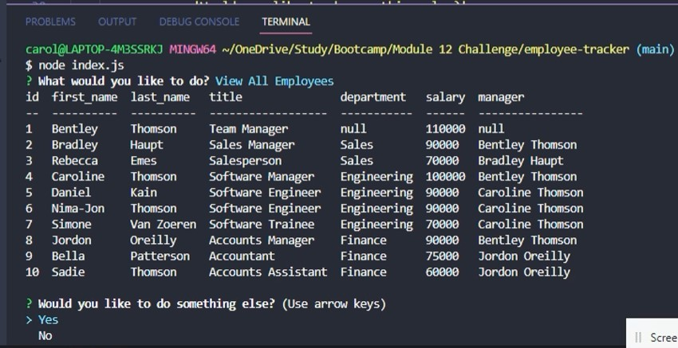
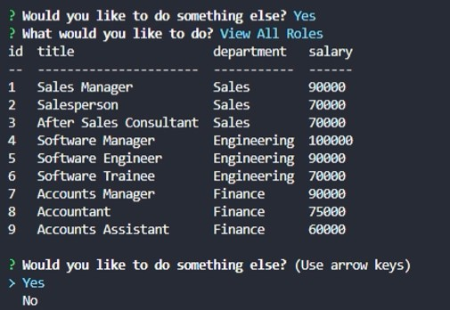
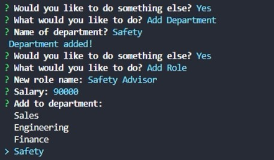
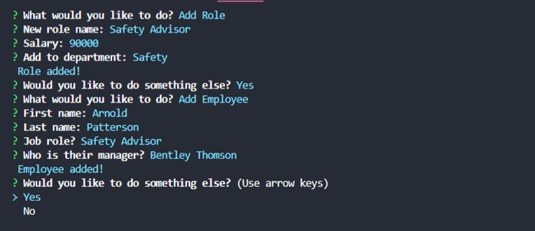

# Employee Tracker
## Description
Command-line application to manager a company's employee database, using Node.js, Inquirer and MySQL.
## Table of Contents
1. [User Story](#user-story)
1. [Acceptance Criteria](#acceptance-criteria)
1. [Installation](#installation)
1. [Usage](#usage)
1. [Screenshots](#screenshots)
1. [Links](#links)
## User Story
```
AS A business owner
I WANT to be able to view and manage the departments, roles, and employees in my company
SO THAT I can organize and plan my business
```
## Acceptance Criteria
```
GIVEN a command-line application that accepts user input
WHEN I start the application
THEN I am presented with the following options: view all departments, view all roles, view all employees, add a department, add a role, add an employee, and update an employee role
WHEN I choose to view all departments
THEN I am presented with a formatted table showing department names and department ids
WHEN I choose to view all roles
THEN I am presented with the job title, role id, the department that role belongs to, and the salary for that role
WHEN I choose to view all employees
THEN I am presented with a formatted table showing employee data, including employee ids, first names, last names, job titles, departments, salaries, and managers that the employees report to
WHEN I choose to add a department
THEN I am prompted to enter the name of the department and that department is added to the database
WHEN I choose to add a role
THEN I am prompted to enter the name, salary, and department for the role and that role is added to the database
WHEN I choose to add an employee
THEN I am prompted to enter the employee’s first name, last name, role, and manager, and that employee is added to the database
WHEN I choose to update an employee role
THEN I am prompted to select an employee to update and their new role and this information is updated in the database
```
## Installation
Run 'npm i' to install dependencies including: console.table, dotenv, inquirer, mysql2. Start by creating the database by running 'mysql -u root -p' and then 'source schema.sql' from the 'db' folder provided. You can then run the command 'source seeds.sql' from the same folder to populate the database.
## Usage
To start using the application, open the terminal and run command 'node index.js' provided in the main directory. You will then be provided a menu from options to choose from.
## Screenshots







## Links
GitHub: [https://github.com/carolinemae](https://github.com/carolinemae/employee-tracker)

Video (demo): [https://drive.google.com/file/d/1c1BFKKA3DgmHXz5bhMX2VhLs7oDMDOUf/view](https://drive.google.com/file/d/1c1BFKKA3DgmHXz5bhMX2VhLs7oDMDOUf/view)

Email: [carolinemaee@live.com](mailto:carolinemaee@live.com)

[Back to the top](#employee-tracker)